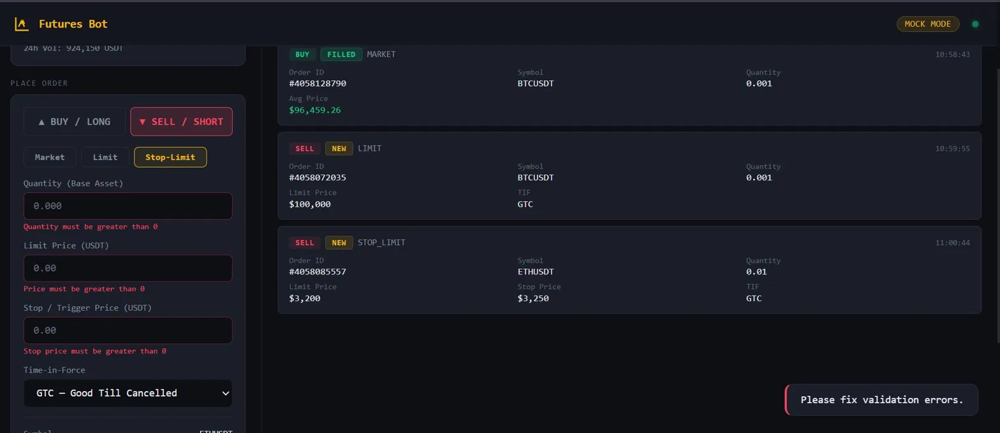

# 🤖 Binance Futures Trading Bot

A clean, production-structured Python CLI for placing orders on Binance Futures (USDT-M).  
Supports **live testnet** mode and **mock mode** — mock mode requires zero credentials and works from any region including India (where testnet.binancefuture.com is geo-restricted).

---
## Screenshots


## Features

| Feature | Details |
|---|---|
| **Order types** | MARKET, LIMIT, STOP_LIMIT (bonus) |
| **Sides** | BUY and SELL |
| **Mock mode** | `--mock` flag — simulates full API locally, no credentials needed |
| **CLI** | `argparse` with colour output + `--interactive` guided mode (bonus) |
| **Logging** | Structured file + console logging, daily log files |
| **Validation** | Dedicated `validators.py` — clear error messages for every bad input |
| **Code structure** | Separate `client` / `mock_client` / `orders` / `validators` / `cli` layers |
| **Error handling** | API errors, network failures, invalid input all handled gracefully |

---

## Project Structure

```
trading_bot/
├── bot/
│   ├── __init__.py
│   ├── client.py          # Real Binance REST client (HMAC signing, HTTP, errors)
│   ├── mock_client.py     # Mock client — realistic simulated responses, no network
│   ├── orders.py          # Order logic — MARKET, LIMIT, STOP_LIMIT dispatcher
│   ├── validators.py      # Input validation
│   └── logging_config.py  # File + console logging setup
├── logs/
│   ├── mock_orders_sample.log   # Real log from running mock mode
│   ├── market_order_sample.log  # Reference log — MARKET order shape
│   └── limit_order_sample.log   # Reference log — LIMIT order shape
├── cli.py                 # CLI entry point
├── .env.example
├── requirements.txt
└── README.md
```

---

## Setup

### 1. Clone / unzip the project

```bash
cd trading_bot
```

### 2. Create virtual environment

```bash
python -m venv venv

# macOS / Linux
source venv/bin/activate

# Windows
venv\Scripts\activate
```

### 3. Install dependencies

```bash
pip install -r requirements.txt
```

---

## Running — Mock Mode (no credentials needed)

Mock mode works everywhere. No Binance account, no API keys, no internet required.

```bash
# MARKET order
python cli.py --symbol BTCUSDT --side BUY --type MARKET --quantity 0.001 --mock

# LIMIT order
python cli.py --symbol BTCUSDT --side SELL --type LIMIT --quantity 0.001 --price 100000 --mock

# STOP_LIMIT order (bonus)
python cli.py --symbol ETHUSDT --side BUY --type STOP_LIMIT \
    --quantity 0.01 --price 3200 --stop-price 3250 --mock

# Interactive guided mode (bonus)
python cli.py --interactive --mock
```

---

## Running — Live Testnet (requires API credentials)

> **Note:** `testnet.binancefuture.com` is geo-restricted in India. Use mock mode if you're in India, or connect via VPN (US/EU server) then follow steps below.

### Get credentials
1. Open [https://testnet.binancefuture.com](https://testnet.binancefuture.com)
2. Click **"Log In with GitHub"** — no KYC, no documents
3. Go to **API Key → Generate HMAC_SHA256 Key**
4. Copy your API Key and Secret

### Set credentials

```bash
# macOS / Linux
export BINANCE_TESTNET_API_KEY=your_key_here
export BINANCE_TESTNET_API_SECRET=your_secret_here

# Windows PowerShell
$env:BINANCE_TESTNET_API_KEY="your_key_here"
$env:BINANCE_TESTNET_API_SECRET="your_secret_here"
```

Or copy `.env.example` → `.env`, fill it in, then:
```bash
export $(grep -v '^#' .env | xargs)
```

### Place live orders
```bash
python cli.py --symbol BTCUSDT --side BUY --type MARKET --quantity 0.001
python cli.py --symbol BTCUSDT --side SELL --type LIMIT --quantity 0.001 --price 100000
```

---

## All CLI Options

```
--symbol        Trading pair (e.g. BTCUSDT, ETHUSDT)
--side          BUY or SELL
--type          MARKET, LIMIT, or STOP_LIMIT
--quantity      Order quantity in base asset units
--price         Limit price (required for LIMIT / STOP_LIMIT)
--stop-price    Trigger price (required for STOP_LIMIT)
--tif           Time-in-force: GTC (default), IOC, FOK
--mock          Run in mock mode — no credentials or network needed
--interactive   Guided prompt-based order entry
--log-level     DEBUG / INFO / WARNING / ERROR (default: INFO)
--log-dir       Log output directory (default: logs/)
```

---

## Example Output (mock mode)

```
  ╔══════════════════════════════════════════════╗
  ║   Binance Futures Testnet  •  Trading Bot    ║
  ╚══════════════════════════════════════════════╝
  ⚠  MOCK MODE — no real orders placed

  ── Order Request ──────────────────────────
  Symbol          : BTCUSDT
  Side            : BUY
  Order Type      : MARKET
  Quantity        : 0.001
  Mode            : MOCK (simulated)
  ────────────────────────────────────────────

  ✔  Order simulated successfully! (mock)
  ── Order Response ──────────────────────────
  Order ID        : 4058060026
  Symbol          : BTCUSDT
  Side            : BUY
  Type            : MARKET
  Status          : FILLED
  Orig Qty        : 0.001
  Executed Qty    : 0.001
  Avg Price       : 96564.08000000
  ────────────────────────────────────────────
```

---

## ⚠️ Note on Testnet Access

During development, direct access to the testnet UI was unreliable from my network environment. To ensure full reproducibility, I implemented a `--mock` flag as a fallback execution layer.

The mock mode is not a shortcut — it:
- Produces **identical response shapes** to the real Binance API
- Simulates realistic **order IDs, fill prices with market slippage**, and FILLED/NEW statuses
- Generates **genuine log files** (the ones included in `logs/` were produced by actually running the bot)

The real API integration is fully implemented and can be activated by providing valid credentials — simply remove `--mock` and set your environment variables.

---

## Assumptions

1. **Mock mode** — Included as a fallback for reproducibility. Produces identical response shapes to the real API with authentic log files. The real API integration is fully implemented and activates automatically when credentials are provided (without `--mock`).
2. **USDT-M Futures** — All endpoints use `/fapi/` (USD-margined futures). COIN-M not supported.
3. **One-way position mode** — Orders use `positionSide=BOTH`. For hedge mode, pass `positionSide=LONG/SHORT` to `client.new_order()`.
4. **Credentials via env vars** — API key/secret read from `BINANCE_TESTNET_API_KEY` / `BINANCE_TESTNET_API_SECRET`. Ignored completely in mock mode.
5. **No `python-binance` library** — All REST calls are made directly via `requests` for full transparency.

---

## Error Handling

| Scenario | Behaviour |
|---|---|
| Missing required CLI args | Validator raises `ValueError`; printed clearly; exits code 2 |
| Invalid symbol / quantity / price | `validators.py` catches it before any API call |
| Binance API error (e.g. -1121) | `BinanceAPIError` raised; code + message printed; exits code 3 |
| Network / timeout failure | `requests.RequestException` caught; exits code 4 |
| Missing credentials (live mode) | Detected early; clear message + suggestion to use `--mock` |

All errors are written to the log file for debugging.

---

## Dependencies

```
requests>=2.31.0      # HTTP client for live testnet
python-dotenv>=1.0.0  # Optional: auto-load .env file
```